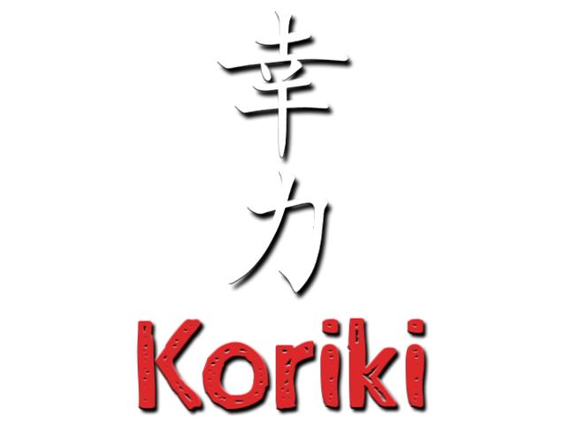

# Koriki

Koriki es una recopilación de software para la tarjeta microSD de la retro consola [Miyoo Mini](https://lemiyoo.cn/product/143.html). Se ejecuta sobre el firmware stock y fundamentalmente porta el frontend [SimpleMenu](https://github.com/fgl82/simplemenu) a este dispositivo.

En este repositorio encontrarás todas las piezas software necesarias para construir la distribución, pero si sólo te interesa utilizar el resultado final, puedes acudir al apartado [releases](https://github.com/Rparadise-Team/Koriki/releases) para coger una compilación funcional de la misma hecha por nosotros. Consulta la documentación en el [wiki](https://github.com/Rparadise-Team/Koriki/wiki) para conocer el procedimiento de instalación.

## Componentes

La base de la distribución son una serie de ficheros estáticos que pueden encontrarse en el directorio `base` de este repositorio. Sobre esta base se han compilado/instalado una serie de proyectos de otras personas que más adelante detallaremos.

El resultado, es decir la base más los binarios, se deben copiar sobre una tarjeta microSD en formato FAT32.

A continuación enumeramos los binarios que es necesario compilar si quieres construir la distribución por ti mismo, así como la localización de sus fuentes. La ruta que se indica para los binarios parte de la raíz de la tarjeta microSD.

Para compilar se ha utilizado el toolchain de @shauninman que puede encontrarse [aquí](https://github.com/shauninman/union-miyoomini-toolchain).

#### SimpleMenu

* Repositorio:
* Ubicación del binario final: `.simplemenu/simplemenu`
* Observaciones: Para compilar SimpleMenu, previamente deberemos haber compilado e instalado en nuestro toolchain las siguientes librerías:
    * libini: https://github.com/pcercuei/libini
    * libopk: https://github.com/pcercuei/libopk
* Comando compilación: `make PLATFORM=MMIYOO MM_NOQUIT=1 NOLOADING=1`

* SimpleMenu
    * Build: invoker.dge     #### Remove calls to opkrun and delete from Koriki/bin
    * Build: simplemenu             
* App/Bootscreen Selector
    * Build: bootScreenSelector     make
* App/DinguxCommander:
    * Build: DinguxCommander
* App/Gmu:
    * Build: gmu.bin
* App/System Info
    * Build: systemInfo             make
* Koriki/bin:
    * audioserver.mod by Eggs
    * Build: charging               make
    * Build: keymon                 make
    * Build: show
* Retroarch:
    * Build: retroarch
* Koriki/version.txt
* .deletes
* .update_splash.png

## Telegram channel for updates

Join this Telegram channel to get update notifications: ####
