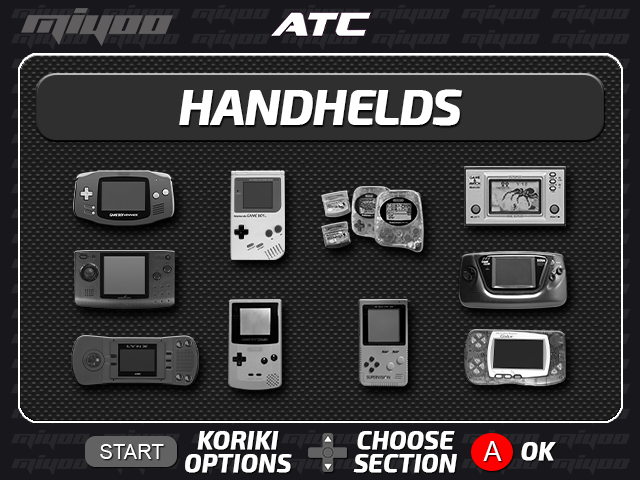
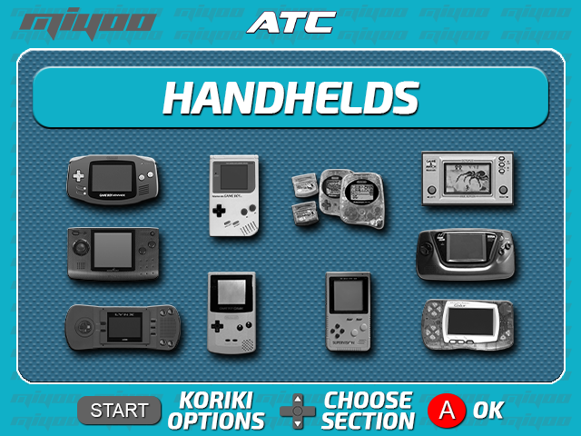
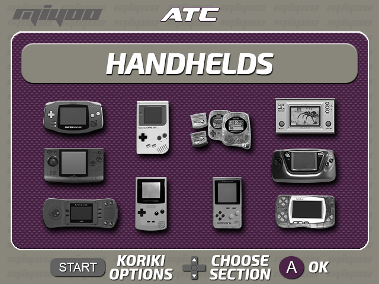
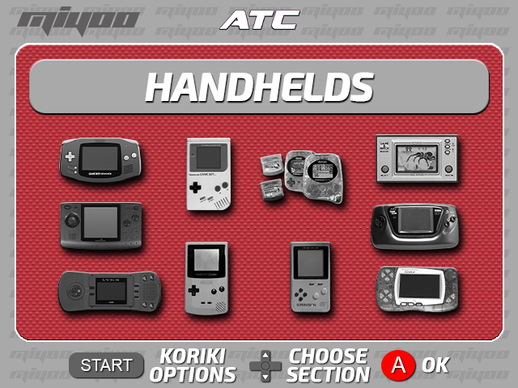
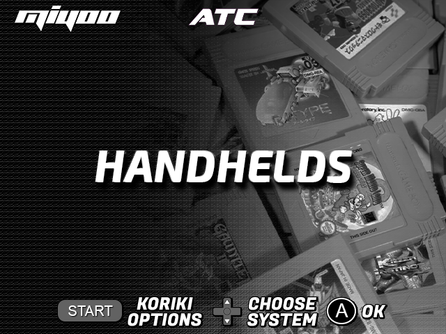
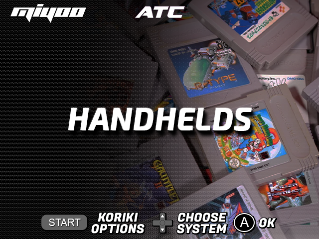
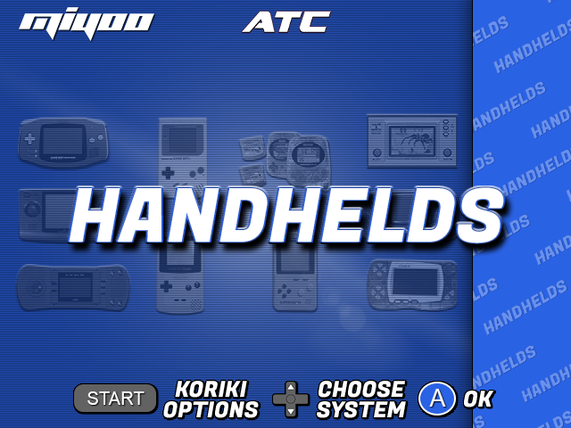
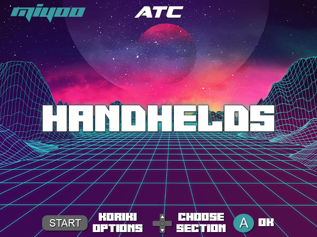

Koriki is essentially an adaptation of @FGL82's SimpleMenu frontend for the Miyoo Mini. It runs on the official firmware installed on the internal storage of the console. Specifically, it has only been tested on firmware version 2022-04-19. If you have an earlier version, it is recommended to upgrade to this version. You can check the installed version by booting the console without the card inserted and going to the `Settings > Device Info > Version` path. [This guide](https://github.com/TriForceX/MiyooCFW/wiki/Miyoo-Mini#firmware-update-guide) describes the process if an upgrade is required.

As emulation frontend we have used the RetroArch compilation adapted to Miyoo Mini made by [Eggs](https://discordapp.com/users/778867980096241715) which can be found [here](https://www.dropbox.com/sh/hqcsr1h1d7f8nr3/AABtSOygIX_e4mio3rkLetWTa?preview=RetroArch_Dingux_forMiyooMini_220525.zip).

In addition to SimpleMenu, a few applications/utilities and the SDL libraries used to compile all the programs have been added. We have also included a compilation of 8 new themes for SimpleMenu inspired in Miyoo Mini and made by @albgr1979. As an example, the cover of the Handhelds section of each of the themes is shown:

Finally, all the parts have been wired to make the user experience as seamless as possible. That is to say, all possible RetroArch cores have been configured in the different systems included in the SimpleMenu configuration. We hope you like it.
