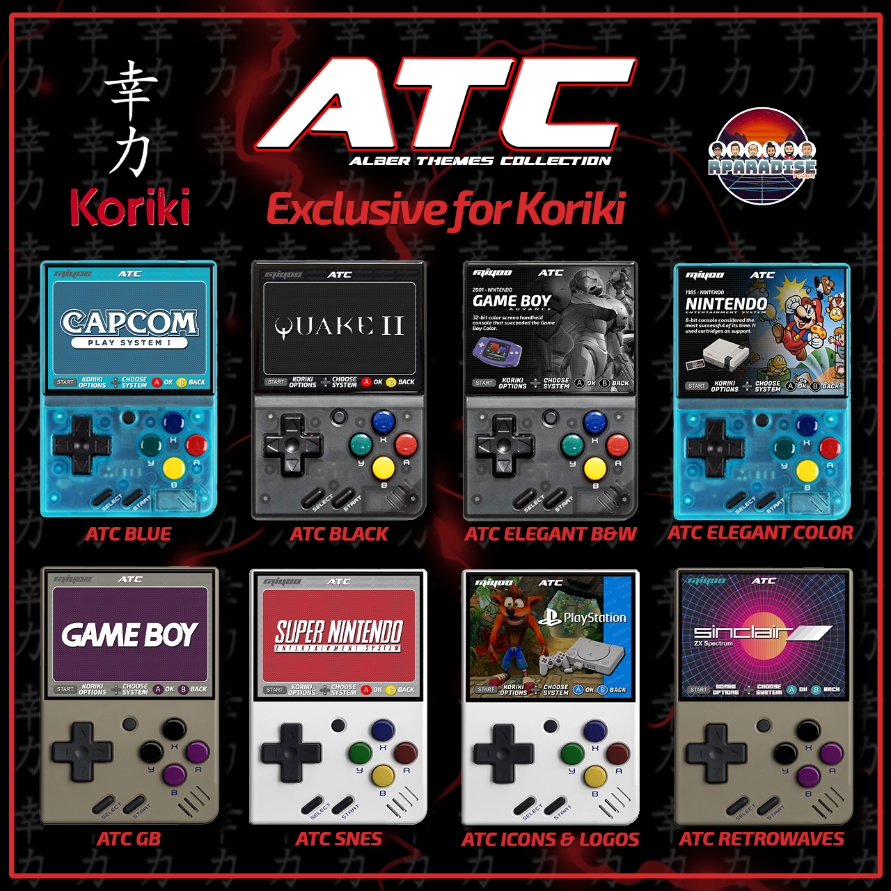

Koriki es fundamentalmente una adaptación del frontend SimpleMenu de @FGL82 para Miyoo Mini. Se ejecuta sobre el firmware oficial instalado en el almacenamiento interno de la consola. Concretamente ha sido únicamente probado sobre la versión 2022-04-19 del firmware. En caso de contar con una versión anterior se recomienda actualizar a dicha versión. Puede comprobarse la versión instalada arrancando la consola sin tarjeta insertada y acudiendo a la ruta `Settings › Device Info › Version`. [Esta guía](https://github.com/TriForceX/MiyooCFW/wiki/Miyoo-Mini#firmware-update-guide) describe el proceso si es necesario actualizar.

Como frontend de emulación se ha utilizado la compilación de RetroArch adaptada a Miyoo Mini hecha por [Eggs](https://discordapp.com/users/778867980096241715) que puede encontrarse [aquí](https://www.dropbox.com/sh/hqcsr1h1d7f8nr3/AABtSOygIX_e4mio3rkLetWTa?preview=RetroArch_Dingux_forMiyooMini_220525.zip).

Además de SimpleMenu se han añadido unas pocas aplicaciones/utilidades y librerías. También se han incluido una compilación de 8 themes nuevos para SimpleMenu ambientados en Miyoo Mini, realizados por @albgr1979:

Por último se han cableado todas las piezas para que la experiencia de uso sea lo más cómoda posible. Es decir, se han configurado todos los cores de RetroArch posibles en los distintos sistemas incluidos en la configuración de SimpleMenu. Esperamos que os guste.
