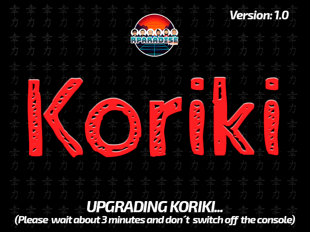

## Instalación desde cero

Este es el procedimiento de instalación a utilizar la primera vez que se instala Koriki:

1. Descargar la última distribución del apartado [releases de este repositorio](https://github.com/Rparadise-Team/Koriki/releases/latest).
2. Descomprimir el zip descargado en el paso anterior sobre una tarjeta microSD vacía en formato FAT32 y sin label definida.
3. Expulsar con seguridad la microSD del PC (siguiendo las recomendaciones de nuestro sistema operativo).
4. Insertar la microSD en la consola y encenderla.

## Actualización

Si tenemos una versión previa de Koriki instalada y queremos instalar un parche o actualización, el procedimiento será el que se detalla a continuación. Antes de instalar, comprobar si el parche o actualización es adecuado siguiendo las instrucciones que acompañen al paquete contrastando con la versión de Koriki que tengamos instalada en ese momento que podremos ver por medio de la aplicación `System Info` que encontraremos en la sección `Apps & Games > Apps`.

1. Descargar el paquete de actualización (ya sea un parche o la distribución completa) del apartado [releases de este repositorio](https://github.com/Rparadise-Team/Koriki/releases).
2. Copiar el zip descargado en el paso anterior a la raíz de la microSD de la consola.
3. Expulsar con seguridad la microSD del PC (siguiendo las recomendaciones de nuestro sistema operativo).
4. Insertar la microSD en la consola y encenderla. En pantalla deberá aparecer una imagen describiendo la versión del parche o actualización que se instalará así como el tiempo aproximado que le llevará terminar.

En caso de problemas con el procedimiento anterior, podemos instalar el parche o actualización manualmente siguiendo los mismos pasos de la [Instalación desde cero](#instalacion_desde_cero) haciendo la descompresión del zip sobre la tarjeta con Koriki ya instalado. Para que la instalación sea lo más correcta posible, antes de descomprimir el zip visualizaremos el fichero `.deletes` que encontraremos en el zip y borraremos manualmente los ficheros o directorios que allí encontremos identificados con su ruta completa.
