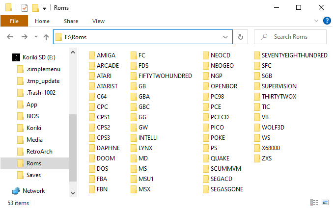
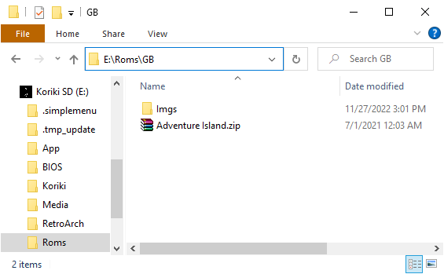
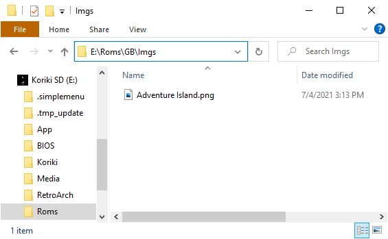
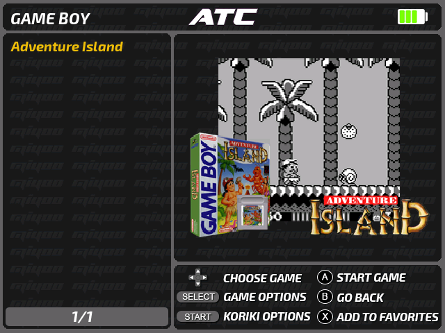
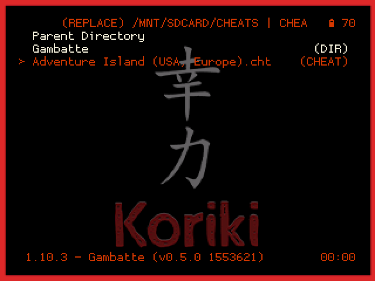
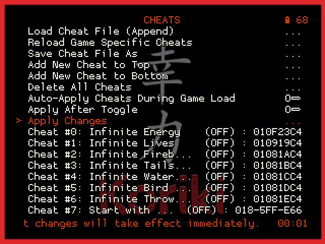

The board we have prepared during the [installation process](#) is empty of contents. It only contains the SimpleMenu frontend, the RetroArch cores, a few utilities as well as libraries for proper execution. The configuration of the emulators has been made so that most of what could be considered user content, is located in the root of the microSD card. Specifically the following directories which will be described in more detail in the following:

* `Roms`: ROMs and game datafiles.
* `BIOS`: BIOS needed by some systems.
* `Saves`: Scores, savestates.
* `Cheats`: Tweaks for games.

For this reason, these four directories will be the ones to back up from time to time (especially `Saves`) as well as to keep in case we proceed to do a [fresh installation](#).

Before continuing, we will make a brief comment on the legal considerations of installing such contents. The matter is complex. If you are interested, a good article is [this Retro Game Corps post](https://retrogamecorps.com/2020/08/18/legal-guide-is-downloading-retro-game-files-roms-illegal/). Although there are few legal precedents on the subject, the problem primarily affects BIOS and ROMs. In a simplified way, it is usually considered that we can handle the ROMs of the games and the BIOS of the machines that we own. Actually it is more of a rule based on common sense, since as we say, there are few legal sentences on the subject and of course the opinion of the different participants in the industry is not consistent.

## ROMs

The SimpleMenu frontend has been configured with a series of predefined paths where it will try to locate ROMs and graphical previews. These paths will be created when we install the system for the first time. If you don't want to modify the SimpleMenu configuration, you will have to stick to these paths. In the table below, the second column shows the name of the directory that will have to exist on the microSD card as it will look when mounted on the PC. For example, the screenshot below shows the Game Boy system ROMs directory, which as you can see is located together with all the others in the `Roms` folder in the root of the card.



The above path on the PC will correspond to `/mnt/SDCARD/Roms` on the console system, once the card is in the console and the system is booted. In case you modify the SimpleMenu configuration, this is the type of path you will use (e.g. `/mnt/SDCARD/Roms/GB` for Game Boy).

Below is the table of the systems configured in SimpleMenu with the paths where the ROMs must be placed, the extensions they must have and the emulators or cores configured in each one of them (which can be selected at ROM level by pressing `SELECT` in the ROM lists):

|System|Paths|Supported extensions|Supported emulators|
|:------|:----|:---------------------|:--------------------|
|MAME|Roms/ARCADE|zip|mame2003_plus_libretro, fbneo_libretro, fbalpha2012_libretro, km_mame2003_xtreme_libretro, mame2000_libretro, mame2010_libretro|
|CPS1|Roms/CPS1|zip|fbalpha2012_cps1_libretro, fbneo_libretro|
|CPS2|Roms/CPS2|zip|fbalpha2012_cps2_libretro, fbneo_libretro|
|CPS3|Roms/CPS3|zip|fbalpha2012_cps3_libretro, fbneo_libretro|
|SNK Neo Geo|Roms/NEOGEO|zip, 7z|fbalpha2012_neogeo_libretro|
|Final Burn Alpha|Roms/FBA|zip|fbalpha2012_libretro, fbalpha_libretro|
|Final Burn Neo|Roms/FBN|zip|fbneo_libretro|
|Daphne|Roms/DAPHNE|zip|daphne_libretro|
|Nintendo NES|Roms/FC|nes, zip, 7z|fceumm_libretro, nestopia_libretro|
|Nintendo Famicom Disk System|Roms/FDS|fds, zip, 7z|fceumm_libretro, nestopia_libretro|
|Nintendo SNES|Roms/SFC|smc, sfc, zip, 7z|mednafen_supafaust_libretro, snes9x2005_libretro, snes9x2005_plus_libretro, snes9x2002_libretro, snes9x2010_libretro, snes9x_libretro, snes9x_next_libretro, quicknes_libretro|
|Nintendo SNES MSU-1|Roms/MSU1|smc, sfc, zip, 7z|snes9x_libretro|
|Nintendo Super Game Boy|Roms/SGB|gb, gbc, zip, 7z|mgba_libretro|
|Nintendo Virtual Boy|Roms/VB|vb, vboy, bin, zip, 7z|mednafen_vb_libretro|
|SEGA SG-1000|Roms/SEGASGONE|zip, sg, 7z|gearsystem_libretro, genesis_plus_gx_libretro|
|SEGA Master System|Roms/MS|zip, sms, 7z|picodrive_libretro, genesis_plus_gx_libretro, gearsystem_libretro|
|SEGA Megadrive|Roms/MD|zip, bin, smd, md, mdx, gen, 7z|picodrive_libretro, genesis_plus_gx_libretro|
|SEGA CD|Roms/SEGACD|bin, chd, cue|picodrive_libretro, genesis_plus_gx_libretro|
|SEGA 32X|Roms/THIRTYTWOX|zip, 32x, 7z|picodrive_libretro|
|Atari 2600|Roms/ATARI|bin, a26, zip, 7z|stella2014_libretro|
|Atari 5200|Roms/FIFTYTWOHUNDRED|bin, a52, zip, 7z|a5200_libretro, atari800_libretro|
|Atari 7800|Roms/SEVENTYEIGHTHUNDRED|bin, a78, zip, 7z|prosystem_libretro|
|Intellivision|Roms/INTELLI|int, bin|freeintv_libretro|
|SNK Neo Geo CD|Roms/NEOCD|zip, chd|neocd_libretro|
|NEC PC Engine|Roms/PCE|pce, tg16, cue, zip, 7z|mednafen_pce_fast_libretro, mednafen_supergrafx_libretro|
|NEC PC Engine CD|Roms/PCECD|pce, tg16, cue, chd, zip, 7z|mednafen_pce_fast_libretro, mednafen_supergrafx_libretro|
|Sony PlayStation|Roms/PS|bin, pbp, chd, zip, cue, img, iso, m3u|pcsx_rearmed_libretro, pcsx_rearmed_libretro_old, pcsx_rearmed_libretro_shaun|
|Nintendo Game Boy|Roms/GB|gb, gz, zip, 7z|gambatte_libretro, gearboy_libretro|
|Nintendo Game Boy Color|Roms/GBC|gbc, zip, 7z|gambatte_libretro, gearboy_libretro|
|Nintendo Game Boy Advance|Roms/GBA|gba, zip, 7z|gpsp_libretro, mgba_libretro, mednafen_gba_libretro, meteor_libretro, vbam_libretro, vba_next_libretro|
|Nintendo Game&Watch|Roms/GW|mgw, zip, 7z|gw_libretro|
|SEGA Game Gear|Roms/GG|zip, gg, 7z|picodrive_libretro, genesis_plus_gx_libretro, gearsystem_libretro|
|Atari Lynx|Roms/LYNX|zip, lnx, 7z|handy_libretro, mednafen_lynx_libretro|
|SNK Neo Geo Pocket|Roms/NGP|ngp, ngc, ngpc, npc, zip, 7z|mednafen_ngp_libretro|
|WonderSwan|Roms/WS|ws, wsc, pc2, zip, 7z|mednafen_wswan_libretro|
|Pokemon Mini|Roms/POKE|min, zip, 7z|pokemini_libretro|
|Watara Supervision|Roms/SUPERVISION|sv, bin, 7z, zip|potator_libretro|
|Sinclair ZX Spectrum|Roms/ZXS|tzx, tap, z80, rzx, scl, trd, dsk, zip, 7z|fuse_libretro|
|Amstrad CPC|Roms/CPC|dsk, sna, tap, cdt, voc, cpr, m3u, zip, 7z|crocods_libretro|
|Commodore 64|Roms/C64|crt, d64, t64, bin, g64, 7z, zip|vice_x64_libretro|
|MSX|Roms/MSX|rom, ri, mx1, mx2, col, dsk, cas, sg, sc, m3u, zip, 7z|bluemsx_libretro, fmsx_libretro|
|Atari ST|Roms/ATARIST|a78, rom|hatari_libretro|
|Commodore Amiga|Roms/AMIGA|adf, adz, dms, fdi, ipf, hdf, hdz, lha, slave, info, cue, ccd, nrg, mds, iso, chd, uae, m3u, zip, 7z, rp9|puae_libretro, uae4arm_libretro, puae2021_libretro|
|Wolfenstein 3D|Roms/WOLF3D|ecwolf|ecwolf_libretro|
|Doom|Roms/DOOM/DOOM, Roms/DOOM/DOOM2|wad, zip, 7z|prboom_libretro|
|Quake|Roms/QUAKE/id1, Roms/QUAKE/hipnotic, Roms/QUAKE/rogue, Roms/QUAKE/dopa|fbl|tyrquake_libretro|
|MS-DOS|Roms/DOS|zip, dosz, exe, com, bat, iso, cue, vhd, m3u, 7z|dosbox_pure_libretro|
|Nec PC98|Roms/PC98|hdi, fdi|nekop2_libretro, np2kai_libretro|
|OpenBOR|Roms/OPENBOR|pak|openbor_standalone|
|Pico8|Roms/PICO|png, p8|fake08_libretro, retro8_libretro|
|TIC80|Roms/TIC|tic, 7z|tic80_libretro|
|ScummVM|Roms/SCUMMVM|scummvm|scummvm_libretro|
|Sharp X68000|Roms/X68000|dim, zip, img, d88, 88d, hdm, dup, 2hd, xdf, hdf, cmd, m3u, 7z|px68k_libretro|

Almost all systems in the `Home Computers` category related to the PC architecture, have the problem that the game data files are multiple, not a single file or ROM as on consoles or 8-bit microcomputers. On these systems, it is convenient to use some technique so that the SimpleMenu listings show a single entry per game, and not a set of oddly named files with only one file to select to start the game. Clarifications on some of these cases are given below.

### Wolfenstein 3D

Although the core used to emulate the games on this system (`ecwolf_libretro`) supports `wl6`, `n3d`, `sod`, `sdm`, `wl1`, `pk3` and `exe` extensions, only a special `ecwolf` extension has been configured. This extension has proven to work well for encapsulating all the files in a game. We will show how to proceed using the `Spear of Destiny` game as an example. The data files for this game are as follows:

```
AUDIOHED.SOD
AUDIOT.SOD
GAMEMAPS.SOD
MAPHEAD.SOD
VGADICT.SOD
VGAGRAPH.SOD
VGAHEAD.SOD
VSWAP.SOD
```

As we can see, if we allowed the `sod` extension in this system, all these files would appear in the list and it would be difficult to identify the game in question and the main file to open. The solution is to create a text file in the same directory with the following content:

```
DATA=SOD
-- end --
```

The name of the file will be whatever we want it to appear in the listing, i.e. the name of the game, and the extension will be the aforementioned `.ecwolf`. For example in this case we could call it `Spear of Destiny.ecwolf`.

You will have to adapt the value of the `DATA` parameter to the extension of the game files. For example in the original `Wolfenstein 3D` game, the data files have the extension `WL6`, so the file we can call `Wolfenstein 3D.ecwolf` in this case will contain the following:

```
DATA=WL6
-- end --
```

### Doom

In this system, two directories have been set up, one for installing mods based on the original Doom engine (we will call it Doom 1 from now on) and one for the Doom 2 engine. All files, both engine and mod files, use the `.wad` extension, but unlike in Quake, the files can be renamed. The only condition is that in the same directory where the mod exists, there is the wad of the corresponding engine. This way, Doom 1 and 2 mod wads can coexist in their corresponding directories with the engine wad. By renaming the mod wads, we can easily distinguish them from the engine.

### Quake

The four directories set up in this system respect the structure needed for the different Expansion Paks described [here](https://docs.libretro.com/library/tyrquake/#loading-quake-and-expansion-paks). The names of the files (`pak0.pak`, `pak1.pak`, ...) inside the different directories cannot be changed, so they get confused between the different games and appear several per game when only `pak0.pak` needs to be launched. A trick discussed by @neilswann80 in [this discussion from another repository](https://github.com/eduardofilo/RG350_adam_image/discussions/177#discussioncomment-2091604) has been used, which consists of creating a link to the file to be launched that we can rename. The links have an `fbl` extension and is therefore the extension configured in SimpleMenu. If the Quake directories contain their corresponding `pak` files, the links for the 4 supported games are generated automatically when the console is booted with the Koriki card installed.

### ScummVM

ScummVM games are composed of several files, so you will have to keep them in directories. The `scummvm` extension indicated in the list above corresponds to a file containing the game ID that we will extract from [this list](https://www.scummvm.org/compatibility/) and place it in the directory where we have the rest of the game files. For example for the game "The Secret of Monkey Island" we will need the files that we can consult in the [ScummVM wiki](https://wiki.scummvm.org/index.php?title=Category:Supported_Games). Specifically for this game [we can see](https://wiki.scummvm.org/index.php?title=The_Secret_of_Monkey_Island) that we will need the files `MONKEY.000` and `MONKEY.001` that we will place in a directory of any name inside the directory configured in SimpleMenu (`Roms/SCUMMVM`). It will be in this same directory where we will have to place the previous file with the extension `scummvm`. According to the ScummVM compatibility list, the ID of "The Secret of Monkey Island" is `monkey`, so the content of the file we will place inside the game directory will be that (`monkey`). The name of the file will be the one that will appear in the SimpleMenu listings, so we can call it `The Secret of Monkey Island.scummvm`, for example.

### MAME

In this system there are 6 different cores, each supporting different romsets. The list of supported romsets in each combination is given below. We link to the datafile used in each case which can be used to check the compatibility of the ROMs:

|Core|Name|Romset|
|:---|:-----|:-----|
|mame2003_plus_libretro|Arcade (MAME 2003-Plus)|[v0.78](https://www.progettosnaps.net/download/?tipo=dat_mame&file=/dats/MAME/MAME_Dats_078.rar)|
|fbneo_libretro|FinalBurn Neo|[FBNeo dat](https://github.com/libretro/FBNeo/blob/master/dats/FinalBurn%20Neo%20(ClrMame%20Pro%20XML%2C%20Arcade%20only).dat)|
|fbalpha2012_libretro|FB Alpha 2012|[0.2.97.44](https://archive.org/download/rg350_arcade/FBN_v0.2.97.44.dat)|
|km_mame2003_xtreme_libretro|MAME 2003 Xtreme (2K21)|[v0.78](https://www.progettosnaps.net/download/?tipo=dat_mame&file=/dats/MAME/MAME_Dats_078.rar)|
|mame2000_libretro|MAME 2000 (0.37b5)|[v0.37b5](http://www.progettosnaps.net/download?tipo=dat_mame&file=/dats/MAME/MAME_Dats_037-52.rar)|
|mame2010_libretro|MAME 2010 (0.139)|[v0.139](https://www.progettosnaps.net/download/?tipo=dat_mame&file=/dats/MAME/packs/MAME_Dats_139.7z)|

## Previews

The previews should be placed in a directory named `Imgs` within each of the ROM directories listed above. For example GB ROM previews should be placed in `Roms/GB/Imgs` being the path from the root of the microSD card when mounted on the PC. The preview files have to be PNGs with the same name as the game (except for the extension).





If we have respected the paths indicated above, later in SimpleMenu the game will be represented as follows:



## BIOS

All emulators installed in the distribution (RetroArch included) have redirected the paths where the BIOS should be to the `BIOS` directory in the root of the microSD card. Similar to the case of ROMs, the `BIOS` directory in the root of the card will correspond to the `/mnt/SDCARD/BIOS` path in the console system (although it won't be frequent, in case you have to locate a BIOS by scanning files from an emulator or core, this will be the path to follow).

Not all emulators need BIOS. This is the case of the machines that did not have it or whose function has been emulated. The BIOS file to be located and the place where it should be, are indicated below. To help identify the correct files, if known, its size in bytes and an MD5 hash are indicated. The cases in which the BIOS is essential for the emulator to work are also marked. If 'NO' is indicated, the emulator will work, but it is recommended to install it in order to get the best compatibility of the games. To check MD5 hashes, the cross-platform utility [Quickhash](https://www.quickhash-gui.org/) is recommended.

The sizes and hashes given are of BIOSes that have been tested to be functional, but not necessarily the only ones possible. That is, on some machines there are several possible BIOS versions, usually because there have been several models of the machines (the PlayStation being one of the most typical cases), or because someone has developed a BIOS with improved capabilities (here the typical case is the Neo Geo and its UNIBIOS).

|System|Path|Size|MD5 hash|Needed?|
|:------|:---|-----:|:-------|:----------|
|SNK Neo Geo|Roms/NEOGEO/neogeo.zip| | |Yes|
|Nintendo Famicom Disk System|BIOS/disksys.rom|8192|`ca30b50f880eb660a320674ed365ef7a`|Yes|
|SEGACD|BIOS/bios_CD_E.bin|131072|`e66fa1dc5820d254611fdcdba0662372`|Yes|
|SEGACD|BIOS/bios_CD_J.bin|131072|`278a9397d192149e84e820ac621a8edd`|Yes|
|SEGACD|BIOS/bios_CD_U.bin|131072|`854b9150240a198070150e4566ae1290`|Yes|
|Atari 5200|BIOS/5200.rom|2048|`281f20ea4320404ec820fb7ec0693b38`|Yes|
|Atari 7800|BIOS/7800 BIOS (U).rom| |`0763f1ffb006ddbe32e52d497ee848ae`|No|
|Intellivision|BIOS/exec.bin|8192|`62e761035cb657903761800f4437b8af`|Yes|
|Intellivision|BIOS/grom.bin|2048|`0cd5946c6473e42e8e4c2137785e427f`|Yes|
|PC Engine CD|BIOS/syscard3.pce|262144|`38179df8f4ac870017db21ebcbf53114`|Yes|
|PlayStation|BIOS/SCPH1001.BIN|524288|`924e392ed05558ffdb115408c263dccf`|Yes|
|Nintendo GB|BIOS/gb_bios.bin|256|`32fbbd84168d3482956eb3c5051637f5`|No|
|Nintendo GBC|BIOS/gbc_bios.bin|2304|`dbfce9db9deaa2567f6a84fde55f9680`|No|
|Nintendo GBA|BIOS/gba_bios.bin|16384|`a860e8c0b6d573d191e4ec7db1b1e4f6`|No, although recommended|
|Atari Lynx|BIOS/lynxboot.img|512|`fcd403db69f54290b51035d82f835e7b`|Yes|
|Pokemon Mini|BIOS/bios.min|4096|`1e4fb124a3a886865acb574f388c803d`|Yes|
|MSX (BlueMSX)|BIOS/Machines/| | |Yes|
|MSX (fMSX)|BIOS/MSX.ROM|32768|`364a1a579fe5cb8dba54519bcfcdac0d`|Yes for MSX|
|MSX (fMSX)|BIOS/MSX2.ROM| |`ec3a01c91f24fbddcbcab0ad301bc9ef`|Yes for MSX2|
|MSX (fMSX)|BIOS/MSX2EXT.ROM| |`2183c2aff17cf4297bdb496de78c2e8a`|Yes for MSX2|
|MSX (fMSX)|BIOS/MSX2P.ROM|32768|`847cc025ffae665487940ff2639540e5`|Yes for MSX2+|
|MSX (fMSX)|BIOS/MSX2PEXT.ROM|16384|`7c8243c71d8f143b2531f01afa6a05dc`|Yes for MSX2+|
|Commodore Amiga|BIOS/kick34005.A500|262144|`82a21c1890cae844b3df741f2762d48d`|Yes for Amiga 500|
|Commodore Amiga|BIOS/kick37175.A500|524288|`dc10d7bdd1b6f450773dfb558477c230`|Yes for Amiga 500+|
|Commodore Amiga|BIOS/kick40063.A600|524288|`e40a5dfb3d017ba8779faba30cbd1c8e`|Yes for Amiga 600|
|Commodore Amiga|BIOS/kick40068.A1200|524288|`646773759326fbac3b2311fd8c8793ee`|Yes for Amiga 1200|
|Commodore Amiga|BIOS/kick40060.CD32|524288|`5f8924d013dd57a89cf349f4cdedc6b1`|No|
|Commodore Amiga|BIOS/kick40060.CD32.ext|524288|`bb72565701b1b6faece07d68ea5da639`|No|
|Wolfenstein 3D|BIOS/ecwolf.pk3| |`d68107770b3ba230d10aa27472a7617b`|Yes|

## Ports

Ports can be installed in any directory. For example we could do it in the `Apps` directory or create a `Ports` directory in the root of the card for example dedicated for them. Then you will need to create a launcher for SimpleMenu in the style of the ones for the pre-installed applications in Koriki. The launchers for the SimpleMenu Apps section are in the `.simplemenu/apps` directory and the ones we need to create for the ports should be in `.simplemenu/games`. The usual way is to create a sh script (we can look for example at how the `Commander` launcher is made). In case you want to put spaces in the names of the games/ports, you will have to create an alias `fgl` instead of an `sh` script (in this case we will look at the launcher of the `Bootscreen Selector` application).

Game/port previews will go in the `.simplemenu/games/Imgs` directory. Similar to the ROM [previews](#previews), the name of the PNGs in that directory should match the name of the `sh` script in the `.simplemenu/games` directory. In case an `fgl` alias is used, the PNG name must be the name of the executable indicated by the `exec` parameter inside it.

## Cheats

RetroArch has a built-in cheat system based on a series of files that can be obtained from [this repository](https://github.com/libretro/libretro-database/tree/master/cht). In Koriki, the directory where we have to place the files, has been redirected to the root of the microSD card to facilitate its installation, as with the ROMs and BIOS. Specifically to the `cheats` directory.

We are going to detail the process using the Game Boy game `Adventure Island` as an example:

1. We will look for the corresponding file in the [repository](https://github.com/libretro/libretro-database/tree/master/cht). Specifically for this game the file is [this](https://raw.githubusercontent.com/libretro/libretro-database/master/cht/Nintendo%20-%20Game%20Boy/Adventure%20Island%20(USA%2C%20Europe).cht).
2. We will copy it to the `Cheats` directory at the root of the microSD card. Actually, the most logical thing is to copy complete collections of systems, keeping the directory structure that we see in the repository.
3. Once the console is booted with the microSD card in place, we will open the game with RetroArch.
4. We access the RetroArch menu (`Menu + X`).
5. We follow the route: `Quick Menu > Cheats > Load Cheat File (Replace)`.
6. A file browser will appear showing the contents of the `Cheats` folder on the card. We locate the file corresponding to the game and select it.

    

7. We will return to the Cheats screen where we will see that the bottom part has been loaded with the cheats. There we can adjust the ones we want (quick adjustment is done with the left/right keys).
8. Finally we select `Apply Changes`.

    

9. If we want the cheat settings we have made to apply between different game sessions, we will have to make an override to the game.

More details on [this guide](https://retrogamecorps.com/2020/12/24/guide-retroarch-on-rg350-and-rg280-devices/#Cheats) by Retro Game Corps.
