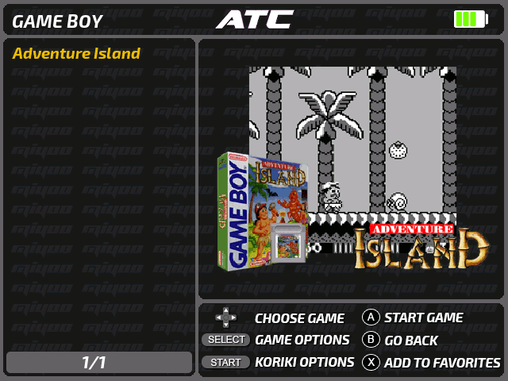
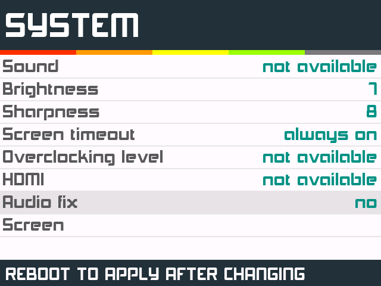

## Ajuste de emulador preferido

En la configuración hecha de SimpleMenu, muchos de los sistemas ofrecen varias opciones de emulación, es decir se puede elegir entre varios emuladores o cores RetroArch. Además el ajuste del emulador o core RA preferido se guarda para cada juego.

Algunos sistemas como MAME la oferta de emuladores es amplia como pudo verse en la tabla del documento [Instalación de contenidos](#). En concreto para este sistema los emuladores (en todos los casos se trata de cores RA) disponibles son:

* mame2003_plus_libretro
* fbneo_libretro
* fbalpha2012_libretro
* km_mame2003_xtreme_libretro
* mame2000_libretro
* mame2010_libretro

Las opciones de emulación aparecen en este orden en el listado, tratándose la primera como opción predeterminada en caso de no indicar manualmente un emulador/core para un juego concreto. Por tanto, si no se cambia, la opción predeterminada para ejecutar los juegos del sistema MAME será el core mame2003_plus_libretro de RetroArch.

Si un juego en concreto no funciona con el emulador predeterminado, pulsaremos `Select` en el listado de juegos de SimpleMenu. Aparecerá un selector con tres opciones, siendo la del emulador a utilizar la tercera. Nos desplazaremos hasta esta tercera opción y cambiaremos el emulador pulsando izquierda/derecha en la cruceta. Para guardar el cambio pulsaremos `B`. Al abrir el juego pulsando `A` se lanzará el core que hayamos elegido. Si el nuevo emulador tampoco funciona correctamente, probar con otra opción hasta obtener un rendimiento adecuado.

Otra situación en las que nos conviene cambiar es cuando el juego se ejecuta lento. Además del sonido entrecortado, la mejor forma de medir si el juego se mueve con soltura es activar el contador de frames por segundo o FPS. En RetroArch podemos activar la opción para un juego en particular en el menú `Main Menu > Settings > On-Screen Display > On-Screen Notifications > Notification Visibility > Display Framerate`, pero si queremos activarlo en general, antes hay que cerrar el contenido que estemos ejecutando. Este sería el procedimiento descrito en detalle.

1. Abrimos el interfaz de Retroarch mediante el lanzador que hay en la sección `Apps & Games > Apps`.
2. Seguir el siguiente camino en los menús: `Main Menu > Settings > On-Screen Display > On-Screen Notifications > Notification Visibility`.
3. Activar la opción `Display Framerate`.
4. Volver hasta el menú raíz pulsando `B` repetidas veces.
5. Entrar en el menú `Configuration File`.
6. Ejecutar el comando de menú `Save Current Configuration`.
7. Volver hasta el menú raíz pulsando `B` una vez.
8. Ejecutar el comando de menú `Quit RetroArch`.

Para desactivarlo procederemos de la misma forma pero desactivando la opción del paso 3.

## Pérdida de rendimiento en algunos juegos

En algunos juegos, sobre todo en los sistemas más costosos de emular como PlayStation o CPS3, es posible que experimentemos una caída de rendimiento conforme se desarrolla el juego, sobre todo en sesiones en las que hayamos estado entrando y saliendo en varios juegos/sistemas. En esos casos, puede ayudar desactivar el audiofix que podemos cambiar en los ajustes de SimpleMenu en el apartado `System`:

Hay que advertir que aunque recuperaremos algo de potencia para que los juegos se ejecuten con más fluidez, será a costa de perder la corrección de lag de sonido que hace el audiofix.
