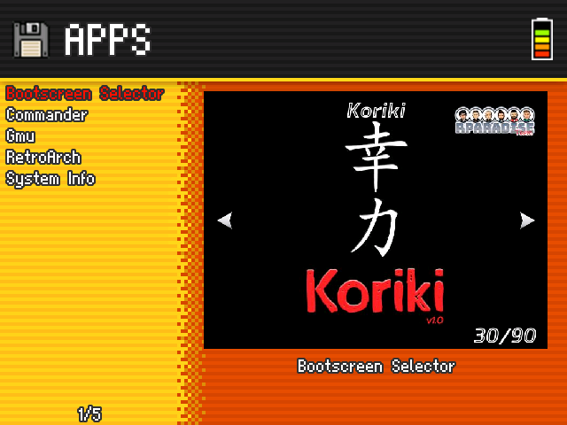
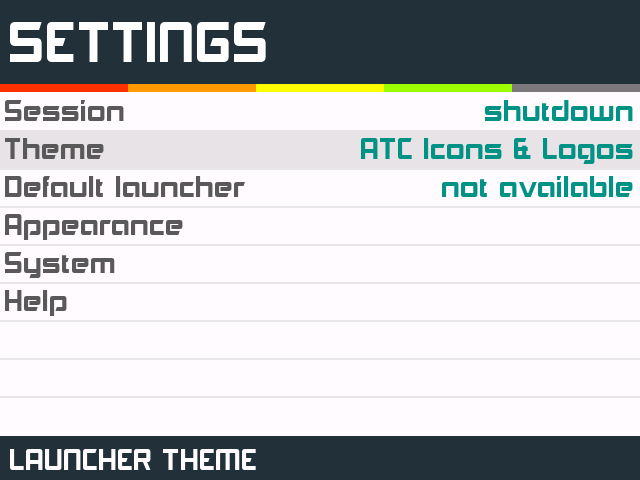

## Q1: Why are the override settings in RetroArch not preserved?

The key in this topic is to understand well the three levels of overrides that exists. If you change a setting and override it at the core level, but then there is an override on the same setting at the content level, the first will not be applied because the second takes precedence. [This guide](https://docs.libretro.com/guides/overrides/) is valuable.

We are going to show an example of one of these cases that is most often asked. It is about activating the option to keep the aspect ratio in GB or GBC. We are going to look at GBC in particular, so in the following greps we do not have to take into account the file `GB.cfg`. That option is called `video_dingux_ipu_keep_aspect` in RA config files. This is the default situation of that setting on the different files that apply, as they are in the image just flashed:

```
edumoreno@HP-Folio13:/media/edumoreno/6D10-080B/RetroArch/.retroarch $ grep video_dingux_ipu_keep_aspect retroarch.cfg
video_dingux_ipu_keep_aspect = "true"
edumoreno@HP-Folio13:/media/edumoreno/6D10-080B/RetroArch/.retroarch $ grep video_dingux_ipu_keep_aspect config/Gambatte/*
config/Gambatte/GB.cfg:video_dingux_ipu_keep_aspect = "false"
config/Gambatte/GBC.cfg:video_dingux_ipu_keep_aspect = "false"
config/Gambatte/Gambatte.cfg:video_dingux_ipu_keep_aspect = "false"
```

In words, the `Keep Aspect Ratio` setting is enabled at a general level (first grep), but then disabled in overrides at the core and content level (second grep).

The logical thing would be that activating it at the content level would start to work, but RetroArch applies a system of economy of settings and when it sees that an adjustment at any level, matches the general adjustment, it simply removes the override adjustment. As a result, when setting this option to `true` and then creating the override at the content level, what actually happens is that the override is lost and the core level is applied, which, as can be seen, is still `false`.

```
edumoreno@HP-Folio13:/media/edumoreno/6D10-080B/RetroArch/.retroarch $ grep video_dingux_ipu_keep_aspect retroarch.cfg
video_dingux_ipu_keep_aspect = "true"
edumoreno@HP-Folio13:/media/edumoreno/6D10-080B/RetroArch/.retroarch $ grep video_dingux_ipu_keep_aspect config/Gambatte/*
config/Gambatte/GB.cfg:video_dingux_ipu_keep_aspect = "false"
config/Gambatte/Gambatte.cfg:video_dingux_ipu_keep_aspect = "false"
```

The solution is to make another override at the core level (which erases the adjustment at that level as well), leaving only the general adjustment.

```
edumoreno@HP-Folio13:/media/edumoreno/6D10-080B/RetroArch/.retroarch $ grep video_dingux_ipu_keep_aspect retroarch.cfg
video_dingux_ipu_keep_aspect = "true"
edumoreno@HP-Folio13:/media/edumoreno/6D10-080B/RetroArch/.retroarch $ grep video_dingux_ipu_keep_aspect config/Gambatte/*
config/Gambatte/GB.cfg:video_dingux_ipu_keep_aspect = "false"
```

In short, you have to activate the keep aspect ratio and save the overrides at the core and content level at same time. It is a mess yes.

## Q2: How can I reset the RetroArch configuration so that I can mount my own overrides without being affected by the ones in Koriki?

Just delete `Retroarch/.retroarch/config` directory and `Retroarch/.retroarch/retroarch.cfg` file, being these paths relative to the root of the microSD card.

## Q3: I can't modify RetroArch config, error `Failed saving config to...` is displayed

To modify the general configuration of RetroArch, there must be no content (ROM) loaded. This can be done in a number of ways:

1. After launching RetroArch through a ROM, open RA menu (`Menu + X`) and use the `Close Content` command.
2. Open the launcher in the `Apps & Games > Apps` section.

In any case, it is not usual to manipulate the general configuration of RetroArch. What most of the time is convenient is to override at the core, content (directory) or game level. Check FAQ number 1 for more details.

## Q4: Why don't appear in SimpleMenu the ROMs I just loaded onto the external card?

There are several things to keep in mind so that the ROMs are displayed:

1. The format of the external card must be FAT32.
2. The ROMs must be found in the appropriate directories for the system to which they belong and which are listed in the table in the [ROMs](#) section.
3. The extensions of the ROMs files must be those indicated in the table in the [ROMs](#) section.
4. To access the list of ROMs of the system that we are interested in, use the navigation shortcuts between systems and groups indicated in the table in the [Controls](#) section. Basically they are `B` to go up one level, `A` to go down one level and `Up/Down` to move between the different elements in each level. For example, the following video shows how to get to the list of Game Boy ROMs from the `Applications` section that appears by default after installing Koriki (the video is made with a different console/system, but the operation is the same).

[](https://www.youtube.com/watch?v=0npzNmlPJb0 "See video")

## Q5: Why does not show battery levels correctly the battery indicator?

Battery are one of the most analog elements on the console. No two are the same. To manage this reality, modern smartphones keep a lot of information about previous charges and the rate and conditions in which the discharge occurs. With all this information, they estimate a battery capacity that is as realistic as possible. In the console system, this data is not kept, so the battery capacity is estimated directly from the voltage that it offers at a certain moment. Fixed values are used for the voltage associated with the maximum and minimum charge (4.2V and 3.4V respectively), which may not be suitable for all batteries, hence some consoles misjudge the charge level.

Finally, the load indicators of the different programs (SimpleMenu, RetroArch) can be programmed differently, so there may be discrepancies between them.

## Q6: Why does the SimpleMenu theme change by itself from time to time?

SimpleMenu is prone to have problems restoring the last session if you modify the files that are addressed on the microSD card through its configuration (basically the ROMs and themes directories). When this happens, it closes and when it reopens it usually finds the same situation again and therefore enters an infinite loop of starts/crashes. During the port to Miyoo Mini, a workaround has been introduced to prevent it from entering this dead end automatically. The workaround consists of deleting the file that stores the session (`.simplemenu/last_state.sav`) when an uncontrolled closing happens. In this way the program starts, but in exchange the configuration is reset, reason why the default theme of SimpleMenu (`0A`) appears. In those situations we will see this:



In any case, the solution to these uncontrolled closings would almost always involve deleting the session file, so the loss of the settings, instead of a collateral damage of this workaround, it is inevitable in these situations.

To restore the settings, press `START` to enter the corresponding menu and rebuild them. Usually you will only need to modify the `Theme` and the settings in the `Appearance` section.


